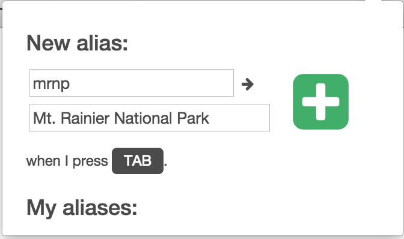
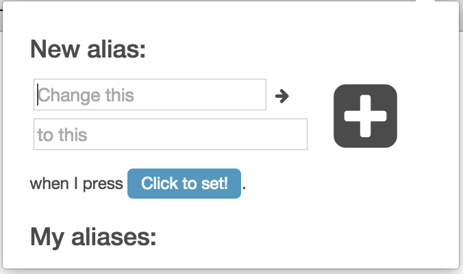
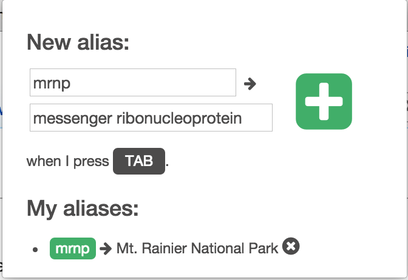
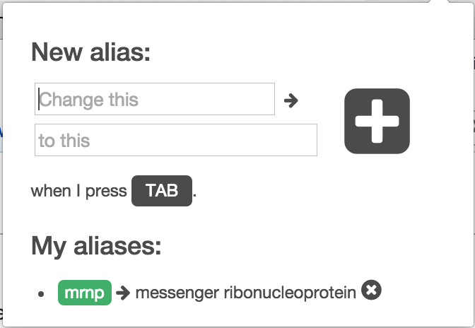
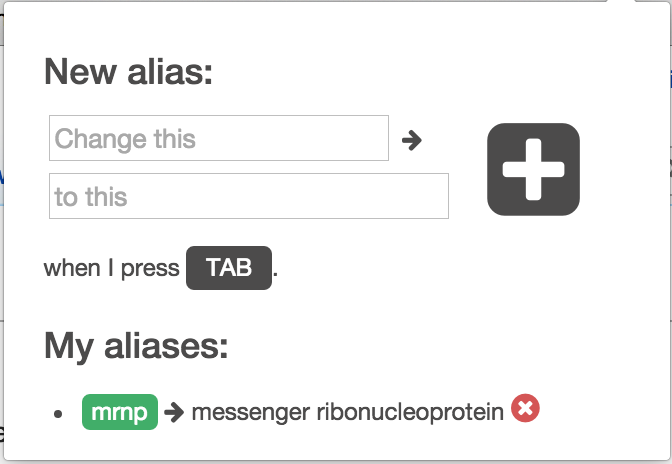

# Aliaser

Aliaser is a light-weight chrome extension that allows users to make shortcuts for longer words or phrases. The extension works with most inputs and textareas on the web. Data is stored in the chrome storage.

## How to use:
Using Aliaser is simple.

To add an alias, type in the alias, the full text, and hit enter.

To choose which key to autocomplete with, click the "Click to set!" button and press the key you want to autocomplete with.

*Note: Certain keys are not recognized as viable autocomplete options. As a general rule, you can't choose numbers, letters, or keys with important functions, such as 'delete'.*

To change an alias, just overwrite the old text with your new text.

To delete an alias, click the x next to the alias you wish to remove.

